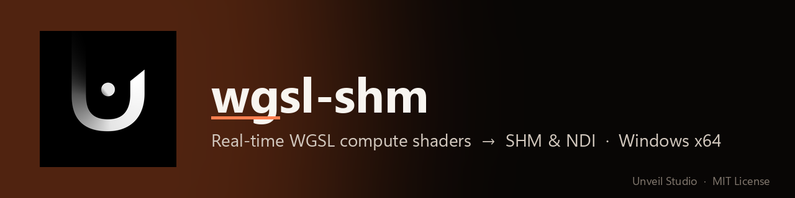
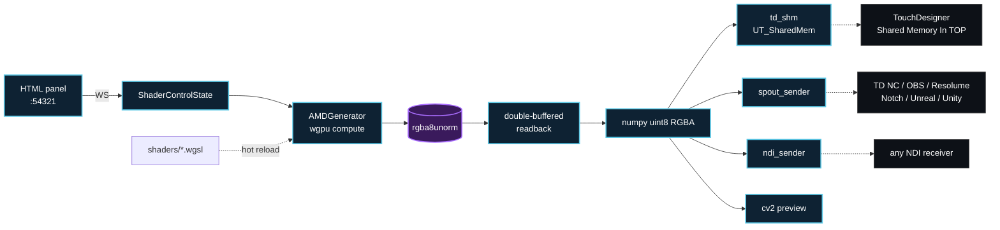
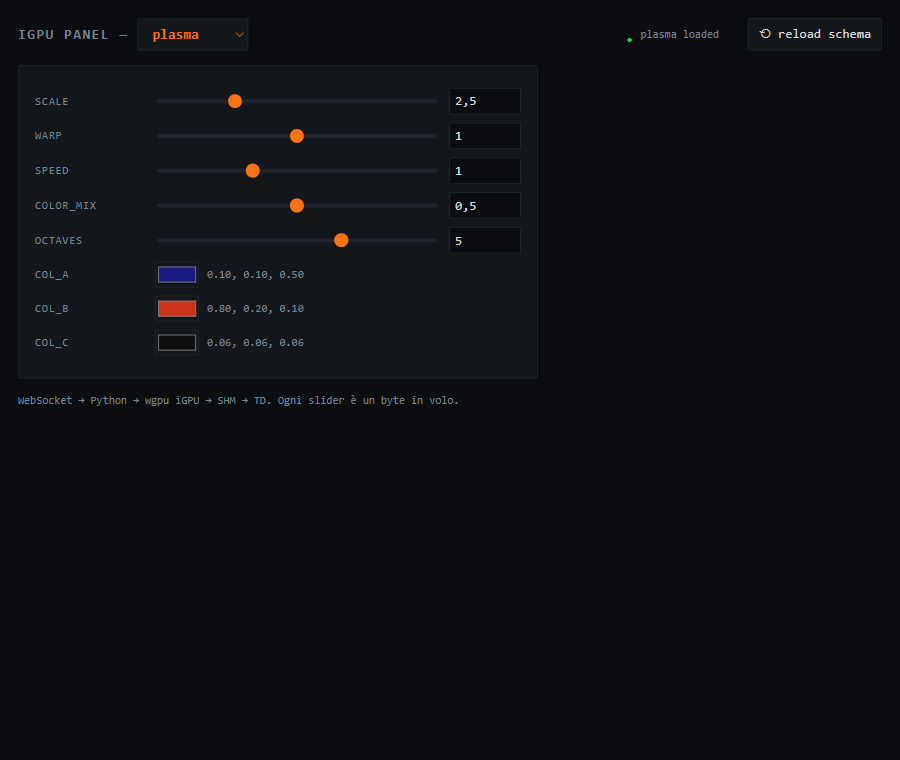

<p align="center">
  
</p>

<p align="center">
  
  
  
  
  
  
  
  <a href="AGENTS.md"></a>
</p>

# wgsl-shm

Real-time **WGSL compute shaders** on **AMD iGPU** → **SHM** (Win32, zero-copy), **Spout** (DX11) or **NDI** (LAN). Built for AMD Ryzen AI 300 / Radeon 880M, runs on any iGPU [wgpu-py](https://github.com/pygfx/wgpu-py) supports. **4K @ 60+ fps** with a live HTML/WebSocket panel and 16 included shaders.

The SHM transport is byte-compatible with TouchDesigner's **Shared Memory In TOP** (UT_SharedMem). Spout opens the same frame to TD Non-Commercial, Resolume, OBS, Notch, Magic, vMix, Unreal, Unity. NDI ships it over the LAN.

> Why these three transports? `wgpu-py` does not currently expose cross-adapter texture sharing, and NDI eats 15-25% CPU. SHM (and Spout for receivers that want a same-machine GPU handle) is zero-copy where it matters and shipping today.

**Windows x64 only** — the SHM transport uses `CreateFileMappingW` + Win32 mutex.

## How it works



Compute runs on the iGPU (system RAM, no PCIe). Readback uses two persistent staging buffers — frame N writes while frame N-1 reads.

## Install

```bash
git clone https://github.com/UnveilStudio/wgsl-shm.git
cd wgsl-shm
pip install -r requirements.txt
pip install opencv-python      # optional, only for --preview
```

## Quick start

```bash
python wgsl_shm.py --preview
```

Panel at <http://127.0.0.1:54321/?ws=54322>. For TouchDesigner, drop without `--preview`:

```bash
python wgsl_shm.py
```

Then add a **Shared Memory In TOP** with `Memory Name = TOPamd`, `Global = OFF`. Zero-copy, native resolution.

Hot reload: save any `shaders/*.wgsl`, the pipeline recompiles. Shader switch live: dropdown in the panel.

## Control panel

<p align="center">
  
</p>

Per-shader uniforms (sliders, number boxes, color pickers) auto-generated from `shaders/<name>.json`. Status pill shows the WS link state and the active shader. Every slider tweak is a single byte hop over WebSocket → Python → wgpu uniform buffer.

## CLI

```
--shader PATH         WGSL to load (default shaders/plasma.wgsl)
--schema PATH         JSON schema of parameters exposed to the panel
--width / --height    output resolution (default 3840 × 2160)
--fps N               cap fps (0 = unlimited)
--profile             GPU dispatch / copy timestamps
--no-ui               disable HTTP / WS server
--port N              HTTP port (WS = port + 1)
--shm-name NAME       SHM name for TD (default TOPamd)
--out shm|ndi|spout   transport (default shm)
--ndi-name / --spout-name NAME   sender names (default = --shm-name)
--ndi-fps N/D         declared NDI frame rate (default 60/1)
--preview             local cv2 window
--preview-scale F     preview window scale (default 0.5)
```

## Shaders

`plasma`, `voronoi`, `truchet`, `kaleido`, `ripple`, `flowfield`, `tunnel`, `nebula`, `particles`, `galaxy`, `fractal`, `electric`, `raymarch`, `blackhole`, `fluid`, `sinewave`.

Add a new one: drop `myshader.wgsl` + `myshader.json` (parameter schema) in `shaders/` and run with `--shader shaders/myshader.wgsl --schema shaders/myshader.json`.

## Transports

| Transport | Mechanism | When |
|---|---|---|
| `--out shm` *(default)* | Win32 file mapping (UT_SharedMem) | TD Commercial/Pro on the **same machine**. Lowest latency. |
| `--out spout` | DX11 shared NT handle | TD **Non-Commercial**, Resolume, OBS, Notch, Magic, Unreal, Unity. |
| `--out ndi` | NDI 5/6 over LAN | Receiver on a **different machine**. |

Python side is zero-copy in all three. Spout pays ~2 ms upload at 4K (DX11 interop, inherent). NDI pays its own encode.

### Spout

```bash
pip install git+https://github.com/UnveilStudio/SPOUT2ForPython.git
```

### NDI

`--out ndi` needs the **NDI Runtime/SDK** (proprietary, not redistributable):

1. <https://ndi.video/download-ndi-sdk/>
2. Install **NDI 6 Tools** (or NDI 5/6 Runtime).
3. `Processing.NDI.Lib.x64.dll` lands in `C:\Program Files\NDI\NDI 6 SDK\Bin\x64\` (or `NDI 5 Runtime\v5\`, or TouchDesigner's `Bin\`). `ndi_sender.py` auto-detects and honours `NDI_RUNTIME_DIR_V6` / `NDI_RUNTIME_DIR_V5`.

Without the runtime, `--out ndi` raises a clear error pointing here. Don't redistribute the DLL.

## Performance

Razer Blade 14 (2025), Radeon 880M, plasma shader, 4K, headless:

| Metric | Value |
|---|---|
| Render | ~4.9 ms |
| Write (Spout) | ~2.3 ms |
| Total | ~7.1 ms (~135 fps over Spout) |

`--preview` adds ~3-5 ms (cv2 imshow on Windows is CPU-only — strictly a debug aid). `--profile` prints separate dispatch / copy ms via WGPU timestamp queries. Default workgroup `(16, 16)` — override per kernel via `AMDGenerator(workgroup=...)`.

## Hardware

Built on a **[Razer Blade 14 (2025)](https://www.razer.com/gaming-laptops/razer-blade-14)**:

| Component | Role |
|---|---|
| AMD Ryzen AI 9 365 (Zen 5 + XDNA2 50 TOPS) | CPU + APU hosting the iGPU |
| AMD Radeon 880M iGPU | Compute target — runs every WGSL kernel, writes directly into system RAM |
| NVIDIA RTX 5070 Laptop (115 W TGP) | Free for downstream — TD compositing, ML, encoding. `wgsl-shm` never touches it. |
| 32 GB LPDDR5X-8000 (up to 64) | Unified RAM — iGPU readback is `memcpy` |

The unified-memory hybrid is the sweet spot: iGPU writes into LPDDR5X, the CPU reads it back without PCIe, the dGPU stays available for the actual show. Same code runs on any AMD iGPU `wgpu-py` supports — but on a non-unified laptop you lose the SHM cost advantage.

## Requirements

- **GPU**: AMD iGPU (tested on Radeon 880M). Discrete AMD also works — edit `pick_igpu_amd()` in `wgsl_shm.py`.
- **OS**: Windows. Linux/macOS need a port of `td_shm.py` (Win32-specific).
- **Python**: 3.10+
- **TouchDesigner**: optional, only needed to consume SHM. 2023.x+.

## Repo layout

```
wgsl-shm/
├── wgsl_shm.py          # CLI entry point
├── amd_generator.py     # compute pipeline + double-buffered readback
├── td_shm.py            # Shared Memory In TOP protocol (UT_SharedMem)
├── ndi_sender.py        # NDI sender via libndi (DLL not bundled)
├── spout_sender.py      # Spout sender (UnveilStudio/SPOUT2ForPython)
├── control/{server,panel.html}   # HTTP + WS panel
├── shaders/             # 16 .wgsl + matching .json schemas
├── docs/{ARCHITECTURE.md,img/}
├── AGENTS.md
└── requirements.txt
```

`td_shm.py` is a clean-room implementation of the publicly documented `UT_SharedMem` wire format used by TouchDesigner's Shared Memory In TOP. No proprietary Derivative source was used.

## Built on top of

- **[wgpu-py](https://github.com/pygfx/wgpu-py)** by Almar Klein et al. — BSD-2. Compute pipeline, buffer mapping, validation.
- **[Spout2](https://github.com/leadedge/Spout2)** by Lynn Jarvis — BSD-2. Wrapped via [`UnveilStudio/SPOUT2ForPython`](https://github.com/UnveilStudio/SPOUT2ForPython).

## Support

- 🟧 **Patreon** — [patreon.com/unveil_studio](https://www.patreon.com/unveil_studio)
- 💸 **PayPal** — [paypal.me/Unveilstudio](https://paypal.me/Unveilstudio)

## License

**MIT** — see [`LICENSE`](LICENSE).

Third-party: `wgpu-py` BSD-2, `numpy`/`websockets` BSD-3/MIT, `opencv-python` Apache 2.0, `SPOUT2ForPython` MIT (bundled `SpoutLibrary.dll` BSD-2 © Lynn Jarvis), **NDI Runtime** proprietary EULA by Vizrt — not part of this project. NDI® is a registered trademark of Vizrt Group.

## The Unveil Studio family

| Project | Accent | What it does |
|---|---|---|
| [NDIForPython](https://github.com/UnveilStudio/NDIForPython) | 🟦 cyan | NDI sender/receiver via `libndi`, ctypes-thin |
| [SPOUT2ForPython](https://github.com/UnveilStudio/SPOUT2ForPython) | 🟪 purple | Spout DX11 GPU sharing, BSD-2 SpoutLibrary.dll bundled |
| **wgsl-shm** *(this repo)* | 🟧 coral | Real-time WGSL compute shaders on AMD iGPU → SHM / Spout / NDI |
| [morpheus-cam](https://github.com/UnveilStudio/morpheus-cam) | 🟪 violet | Real-time body-driven Stable Diffusion · NPU + iGPU + CUDA |
