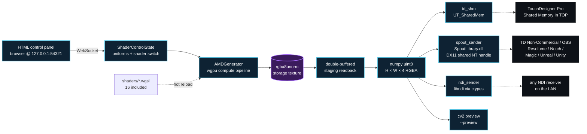

<p align="center">
  
</p>

<p align="center">
  
  
  
  
  
  
  
  <a href="AGENTS.md"></a>
</p>

# wgsl-shm

> **Live performance, no compromise.**

Real-time **WGSL compute shaders** on **AMD integrated GPU** → **Shared Memory** (Win32, zero-copy), **Spout** (DX11 GPU sharing) or **NDI** (LAN streaming).
Built for AMD Ryzen AI 300 / Radeon 880M, runs on any AMD iGPU supported by [wgpu-py](https://github.com/pygfx/wgpu-py). 4K @ 60+ fps with a live HTML/WebSocket control panel and 16 included shaders.

The SHM transport is **byte-compatible with TouchDesigner's Shared Memory In TOP** (UT_SharedMem protocol), tested live. Spout makes the same shaders show up in **TouchDesigner Non-Commercial** (where SHM In TOP isn't available), Resolume, OBS, Notch, Magic, vMix, Unreal, Unity, and any other Spout-aware app. NDI ships the frame over the LAN to receivers that don't share a machine with the producer.

> Why? `wgpu-py` does not currently expose a cross-adapter texture-sharing path, and NDI eats 15-25% CPU. Local SHM (and Spout for receivers that want a GPU handle on the same machine) is zero-copy where it matters, free, and shipping today.

## Built and tested on a hybrid AMD + NVIDIA performance laptop

Developed and benchmarked on a **[Razer Blade 14 (2025)](https://www.razer.com/gaming-laptops/razer-blade-14)** — a deliberate hybrid setup that exposes exactly what `wgsl-shm` is designed to exploit:

| Component | Role in the pipeline |
|---|---|
| **AMD Ryzen AI 9 365** (Zen 5 + XDNA2 NPU 50 TOPS) | CPU + the AMD APU that hosts the iGPU we run shaders on |
| **AMD Radeon 880M iGPU** | Compute target — runs every WGSL kernel, writes directly into system RAM |
| **NVIDIA GeForce RTX 5070 Laptop** (up to 115 W TGP) | Frees up downstream — TouchDesigner / Resolume compositing, ML inference, real-time encoding |
| **32 GB LPDDR5X-8000** (up to 64 GB) | Unified ultra-low-latency memory shared by CPU and iGPU — readback is essentially `memcpy` |

This combo is *the* sweet spot for **live performance with zero compromise**:

- The **AMD iGPU writes into the same LPDDR5X memory the CPU reads** — `dispatch + copy_texture_to_buffer` lands in system RAM, no PCIe round-trip, no cross-adapter sync. That's why we hit **4K @ 60+ fps with headroom to spare**.
- The **NVIDIA dGPU stays free** for the work it's actually best at — final compositing, generative models, encoding the show out to disk or to streaming. `wgsl-shm` never touches it.
- The **XDNA2 NPU** is available for whatever generative model you want to stack on top of the visuals (50 TOPS sitting idle is too good not to use).
- **LPDDR5X-8000 latency** is what makes the SHM hand-off vanishingly cheap — on a non-unified laptop you'd lose this entirely.

In short: you get **discrete-GPU-class compute on the iGPU for free**, the dGPU does what it's good at, and the system memory is fast enough that the bridge between them is a no-op. That's how you ship a live show without dropping frames.

> Same shader, same code, runs on **any AMD iGPU** that `wgpu-py` supports — but the Ryzen AI + LPDDR5X + dGPU combo is what makes `wgsl-shm` realistic for a touring live rig.

**Windows x64 only** at the moment (the SHM transport uses `CreateFileMappingW` + Win32 mutex). NDI output is optional.

## How it works



Compute shaders run **on the iGPU** (system RAM, no PCIe round-trip), readback uses two persistent staging buffers so GPU and CPU overlap (frame N writes while frame N-1 reads). The HTML panel pushes uniforms over WebSocket — slider tweaks land within a frame.

## Agent-friendly

Designed to be picked up by AI coding agents (Claude Code, Cursor, Copilot, …) on the first try without spelunking the source:

- [`AGENTS.md`](AGENTS.md) — TL;DR + how to add a shader, run pipeline, common pitfalls.
- [`docs/ARCHITECTURE.md`](docs/ARCHITECTURE.md) — module map, frame data model, uniform layout convention, SHM protocol cross-checked against TouchDesigner's `UT_SharedMem`.

## Install

```bash
git clone https://github.com/UnveilStudio/wgsl-shm.git
cd wgsl-shm
pip install -r requirements.txt
```

Optional extras:

```bash
pip install opencv-python      # for --preview (cv2 window)
```

## Quick start

```bash
python wgsl_shm.py --preview
```

`--preview` opens a local cv2 window so you can see the output without TouchDesigner. The HTML control panel is served at **http://127.0.0.1:54321/?ws=54322** — open it in any browser to tweak the live shader uniforms.

For a downstream consumer (TouchDesigner shown here, but anything that maps a Win32 file mapping works):

```bash
python wgsl_shm.py
```

In TouchDesigner add a **Shared Memory In TOP**:

| Parameter | Value |
|---|---|
| Memory Name | `TOPamd` |
| Global | OFF |

That's it — the TOP shows your shader at native resolution, zero-copy.

## CLI

```
--shader PATH         WGSL to load (default shaders/plasma.wgsl)
--schema PATH         JSON schema of parameters exposed to the panel
--width / --height    output resolution (default 3840 × 2160)
--fps N               cap fps (0 = unlimited)
--profile             GPU dispatch / copy timestamps
--no-ui               disable HTTP / WS server
--port N              HTTP port (WS = port + 1)
--shm-name NAME       SHM name for TD (default TOPamd)
--out shm|ndi|spout   transport (default shm)
--ndi-name NAME       NDI source name (default = --shm-name)
--ndi-fps N/D         declared NDI frame rate (default 60/1)
--spout-name NAME     Spout sender name (default = --shm-name)
--preview             local cv2 window
--preview-scale F     preview window scale (default 0.5 = 1080p on 4K)
```

Hot reload: save any `shaders/*.wgsl` file, the pipeline recompiles without restart.
Shader switch live: dropdown in the HTML panel.

## Included shaders

| | | | |
|---|---|---|---|
| `plasma` | `voronoi` | `truchet` | `kaleido` |
| `ripple` | `flowfield` | `tunnel` | `nebula` |
| `particles` | `galaxy` | `fractal` | `electric` |
| `raymarch` | `blackhole` | `fluid` | `sinewave` |

Add a new one: drop `myshader.wgsl` + `myshader.json` (parameter schema) into `shaders/` and run:

```bash
python wgsl_shm.py --shader shaders/myshader.wgsl --schema shaders/myshader.json
```

## NDI output (proprietary DLL required)

`--out ndi` uses the **NDI Runtime/SDK** by NewTek/Vizrt. The DLL is **closed-source proprietary** — it cannot be redistributed in this repo. You install it once, free of charge:

1. Go to **https://ndi.video/download-ndi-sdk/**
2. Download and install **"NDI 6 Tools"** (or "NDI 5/6 Runtime" if you only need to run NDI clients)
3. The installer drops `Processing.NDI.Lib.x64.dll` in:

   ```
   C:\Program Files\NDI\NDI 6 SDK\Bin\x64\
   ```

   (or `NDI 5 Runtime\v5\`, or the `Bin\` folder of TouchDesigner). `ndi_sender.py` auto-detects the standard locations and honours `NDI_RUNTIME_DIR_V6` / `NDI_RUNTIME_DIR_V5`.

If you `--out ndi` without the runtime installed you get a clear error pointing back here.

> ⚠️ The NDI DLL is **not** MIT — it has its own EULA. This repo is MIT only for the original code. If you redistribute builds of this project, **do not** include the DLL — users have to install it themselves.

## Transports

Three ways to ship the same RGBA frame out — pick whatever your downstream consumer speaks.

| Transport | Mechanism | CPU-side cost | GPU-side cost | When to use |
|---|---|---|---|---|
| **`--out shm`** *(default)* | Win32 file mapping (UT_SharedMem) | `memcpy` only | none | TouchDesigner Commercial/Pro on the **same machine**. Lowest latency, lowest overhead. |
| **`--out spout`** | DX11 shared NT handle (Spout) | zero (we pass the numpy buffer pointer directly) | ~2 ms upload + GL/DX11 interop at 4K, **inherent to Spout** | TouchDesigner **Non-Commercial** (no SHM In TOP), Resolume, OBS, Notch, Magic, vMix, Unreal, Unity. Same machine, GPU sharing. |
| **`--out ndi`** | NDI 5/6 RTP-like over LAN | zero-copy | NDI internal encode (mDNS announce + UDP) | Receiver on a **different machine** on the LAN. Or when you want to bridge to NDI-aware tools across the network. |

The CPU-side cost is **zero in all three** — we never copy the frame in Python. The numbers above measure overhead added by the transport itself.

> Note: SHM is the fastest path because both sides agree to look at the same RAM. Spout has to push the bytes onto the GPU because that's where DX11 shared textures live; we pass the raw pointer to SpoutLibrary so we don't double-copy. NDI is the only one that crosses the network.

### Spout install

Spout requires the [`UnveilStudio/SPOUT2ForPython`](https://github.com/UnveilStudio/SPOUT2ForPython) package — same family of bindings as this repo, BSD-2 + bundled `SpoutLibrary.dll`:

```bash
pip install git+https://github.com/UnveilStudio/SPOUT2ForPython.git
```

If you `--out spout` without it, the script raises a clear `ImportError` pointing back to that command.

## Performance notes

- **Resolution**: 4K @ 60+ fps on Radeon 880M with the included shaders. Raymarch / fluid drop to ~30 fps depending on iteration count.
- **Headless throughput**: with no `--preview` and no fps cap, the plasma shader reaches **~135 fps over Spout at 4K** (`render≈4.9 ms`, `write≈2.3 ms`, `total≈7.1 ms`) on the reference Razer Blade 14. SHM is faster still — preview-less SHM measurement coming.
- **Preview cost**: `--preview` adds ~3-5 ms / frame for the cv2 imshow GUI thread on Windows and roughly halves throughput at 4K. The standard `opencv-python` wheel is CPU-only on Windows (no CUDA / no DX accel for `cvtColor`/`resize`/GUI), so the preview is **strictly a debug aid for when you don't have a downstream consumer running** — not a hot-path tool. Headless (default) is much faster.
- **`--profile`**: prints separate dispatch / copy ms via WGPU timestamp queries. Useful when authoring a new shader to see whether you're compute-bound or readback-bound.
- **Workgroup size**: shaders default to `(16, 16)`. Override the `workgroup` kwarg in `AMDGenerator(...)` if a particular kernel prefers another layout.

## Hardware / software requirements

- **GPU**: AMD iGPU (tested on Radeon 880M). Discrete AMD also works but the package explicitly picks the integrated one — edit `pick_igpu_amd()` in `wgsl_shm.py` for other targets.
- **OS**: Windows. Linux/macOS need a port of `td_shm.py` (TD SHM is Win32-specific).
- **Python**: 3.10+
- **TouchDesigner**: optional — only needed to consume the SHM. 2023.x+ recommended.

## Repo layout

```
wgsl-shm/
├── wgsl_shm.py          # entry point CLI
├── amd_generator.py     # compute shader pipeline + double-buffered readback
├── td_shm.py            # Shared Memory In TOP protocol (UT_SharedMem)
├── ndi_sender.py        # NDI sender via libndi (DLL not bundled)
├── spout_sender.py      # Spout sender (wraps UnveilStudio/SPOUT2ForPython)
├── control/
│   ├── server.py        # HTTP + WebSocket control panel
│   └── panel.html       # browser UI
├── shaders/             # 16 .wgsl + matching .json schemas
├── docs/ARCHITECTURE.md # module map, dataflow, formats
├── AGENTS.md            # TL;DR for AI coding agents
└── requirements.txt
```

## Built on top of

- **[wgpu-py](https://github.com/pygfx/wgpu-py)** by Almar Klein et al. — the WebGPU Python bindings doing the heavy lifting (compute pipeline, buffer mapping, validation). BSD-2.
- **[Spout2](https://github.com/leadedge/Spout2)** by Lynn Jarvis — the DX11 GPU sharing protocol used by `--out spout`, wrapped via [`UnveilStudio/SPOUT2ForPython`](https://github.com/UnveilStudio/SPOUT2ForPython). BSD-2.

`td_shm.py` is a clean-room Python implementation of the publicly documented `UT_SharedMem` wire format used by TouchDesigner's Shared Memory In TOP. No proprietary Derivative source code was used or referenced — only the protocol shape, which is the explicit contract any third-party producer must implement.

## Support this project

If `wgsl-shm` saves you time or makes its way into something cool, you can throw a beer 🍺 at the maintainer:

- 🟧 **Patreon** — [patreon.com/unveil_studio](https://www.patreon.com/unveil_studio)
- 💸 **PayPal** — [paypal.me/Unveilstudio](https://paypal.me/Unveilstudio)

Every tip is genuinely appreciated and goes straight into keeping this and similar tools alive.

## License

This project is released under the **MIT License** — see [`LICENSE`](LICENSE).

Third-party components have their own licences:

- [`wgpu-py`](https://github.com/pygfx/wgpu-py) — BSD-2
- `numpy`, `websockets` — BSD-3 / MIT
- `opencv-python` (optional, only for `--preview`) — Apache 2.0
- [`SPOUT2ForPython`](https://github.com/UnveilStudio/SPOUT2ForPython) (optional, only for `--out spout`) — MIT, bundled `SpoutLibrary.dll` is BSD-2 © 2020-2024 Lynn Jarvis (Spout2 project)
- **NDI Runtime** (optional, only for `--out ndi`) — proprietary EULA by **Vizrt** / NewTek; not part of this project, see the section above. NDI® is a registered trademark of Vizrt Group.
